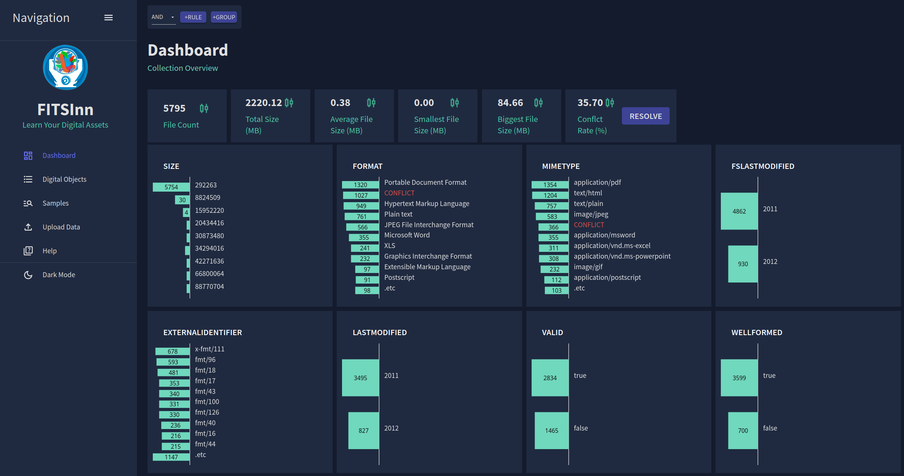

# FITSInn
Place where your FITS files feel good.
## Purpose

FITSInn is a tool to store and analyse technical metadata extracted by characterisation tools such as [FITS](https://projects.iq.harvard.edu/fits/).


The features include:
* Improved user experience through an intuitive UI.
* Running file characterisation using FITS on the uploaded files.
  * The original files are not stored.
* Slice and dice:
  * Filtering,
  * Drill-down,
  * Property value aggregations,
  * Distribution visualisations,
  * Sampling.
* Built-in metadata conflict resolution.
* REST API for workflow automation.


## Installation

### Deployment

The artifacts are released as Docker images. You can install FITSInn using Docker-compose:

```
docker-compose -f docker-compose.yaml up --pull
```

Installation of FITSInn to Docker Swarm or K8S is possible, but is not currently addressed. 


### Local build

Building the Docker images from scratch and starting FITSInn is executed via: 

```
docker-compose -f docker-compose.dev.yaml up --build
```

File uploading using bash:

bash fileupload.sh http://localhost:8082 ~/rnd/data/govdocs_fits/govdocs1/000/

## Issues

If you have any issue regarding FITSInn, please use [https://github.com/datascience/fitsinn/issues](https://github.com/datascience/fitsinn/issues).

## License

FITSInn is released under MIT license. See the [LICENSE](LICENSE) for details.